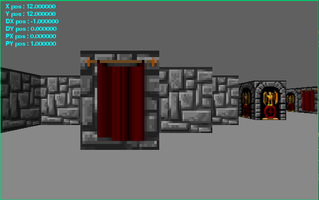
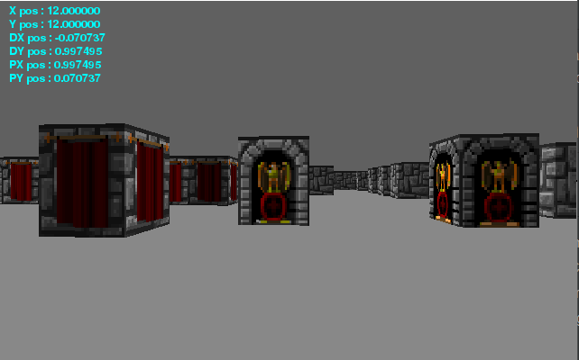

# Wolf3d Ray casting

Project to try emulate the wolf3d ray casting [tutorial](https://lodev.org/cgtutor/raycasting.html) in Python.

## Requirements
The project requires that pygame is installed and version 3.7.3 of Python is used.

To setup run the following commands:
```bash
$ git clone <this_repo>
$ cd <cloned_repo>
$ pip install -r requirements.txt
$ python main.py
```

## Assets

Using original 32bit sprite from Wolfenstein 3d. Sprite is cut and mapped programmatically in Python and stored in
memory for dynamic usage.

## Screenshots





## TODO

- [x] Pygame logic
- [x] Ray Cast
- [x] Player class
- [x] Settings
- [x] Asset Manager
- [ ] Random Map Generator
- [ ] Keep player within walls
- [ ] Movement Optimization
- [ ] Add Player Graphics
- [ ] Add Enemies
- [ ] Add menu
- [ ] Add Sound